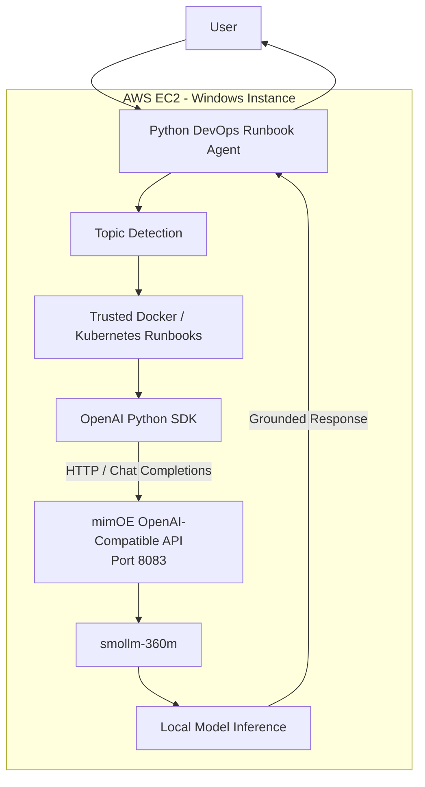

# mimOE Local DevOps Runbook Agent

A lightweight AI agent built using the **BYO Framework** approach with **mimOE Studio**, the **OpenAI Python SDK**, and the locally hosted `smollm-360m` model.

The goal of this project was to explore mimOE Studio, understand its local inference capabilities, connect to its OpenAI-compatible API, and build a small working AI agent that is simple to run, explain, and extend.

---

## Overview

This project implements a focused **DevOps Runbook Agent** for troubleshooting common Docker and Kubernetes issues.

The agent currently supports:

- Docker container restart troubleshooting
- Docker operational commands
- Kubernetes pod troubleshooting
- Kubernetes `CrashLoopBackOff`
- Basic local inference health checks

The application communicates with the `smollm-360m` model through the OpenAI-compatible API exposed by mimOE.

No OpenAI, Anthropic, or other hosted LLM API is used for inference.

---

## Architecture



In this setup, **AWS EC2 is only the host environment**. The language model itself runs through the mimOE runtime on that host.

---

## Why I Built This

The purpose of this exercise was to demonstrate the ability to:

1. Explore an unfamiliar AI platform.
2. Install and configure mimOE Studio.
3. Load and run a local language model.
4. Discover and validate the local inference API.
5. Connect an existing AI SDK to mimOE.
6. Build a small AI agent using the BYO Framework approach.
7. Troubleshoot runtime and resource issues.
8. Explain design choices and limitations clearly.

---

## Technology Stack

- **mimOE Studio**
- **mimOE Runtime**
- **smollm-360m**
- **Python 3**
- **OpenAI Python SDK**
- **python-dotenv**
- **PowerShell**
- **AWS EC2**
- **Git / GitHub**

---

## Development Environment

### Initial Local Attempt

I initially installed mimOE Studio on a Windows desktop with approximately:

```text
8 GB RAM
Intel UHD Graphics 630
NVIDIA GTX 1650 Max-Q
```

During testing, the machine had very limited free memory available:

```text
Total RAM : ~7.85 GB
Free RAM  : ~1 GB
```

When loading the model, mimOE returned errors including:

```text
500 Internal Server Error

llama_model_load_from_file error:
unable to load model
```

I also observed that the runtime could become unavailable after failed model-loading attempts.

---

## Troubleshooting Performed

I validated the environment step by step instead of assuming the model itself was broken.

### Runtime connectivity

```powershell
Test-NetConnection localhost -Port 8083
```

Expected:

```text
TcpTestSucceeded : True
```

### Model registry

```powershell
$headers = @{
    Authorization = "Bearer <API_KEY>"
}

Invoke-RestMethod `
    -Uri "http://localhost:8083/mimik-ai/store/v1/models" `
    -Method GET `
    -Headers $headers
```

The registry confirmed:

```text
Model      : smollm-360m
readyToUse : true
Size       : ~386 MB
```

This showed that the model was registered and downloaded correctly.

### Network connectivity

```powershell
Test-NetConnection huggingface.co -Port 443
```

### Available memory

```powershell
Get-CimInstance Win32_OperatingSystem |
Select-Object `
    @{Name="TotalRAM_GB";Expression={[math]::Round($_.TotalVisibleMemorySize/1MB,2)}},
    @{Name="FreeRAM_GB";Expression={[math]::Round($_.FreePhysicalMemory/1MB,2)}}
```

The main limiting factor on the original desktop was low available memory.

---

## Why I Used AWS EC2

Because the original desktop had limited available memory, I moved the development environment to a better-resourced **Windows AWS EC2 instance**.

This allowed me to:

- run mimOE Studio more reliably,
- keep the mimOE runtime available,
- load `smollm-360m`,
- expose the inference API,
- develop and test the Python agent,
- complete the assignment without changing the application design.

The final setup is:

```text
AWS EC2 Windows Instance
        |
        +-- mimOE Studio
        |
        +-- mimOE Runtime
        |
        +-- smollm-360m
        |
        +-- OpenAI-compatible local API
        |
        +-- Python DevOps Agent
```

Inference is still performed by the **mimOE runtime**, but the runtime host is the EC2 virtual machine rather than the original physical desktop.

---

## mimOE API

After loading `smollm-360m`, mimOE exposes an OpenAI-compatible API.

Example base URL:

```text
http://<MIMOE_HOST>:8083/mimik-ai/openai/v1
```

The chat-completions endpoint follows the OpenAI-compatible pattern:

```text
POST /chat/completions
```

The Python application uses:

```python
from openai import OpenAI

client = OpenAI(
    base_url=MIMOE_BASE_URL,
    api_key=MIMOE_API_KEY,
)
```

and sends requests with:

```python
client.chat.completions.create(...)
```

This makes it easy to reuse familiar OpenAI SDK patterns while routing inference to mimOE.

---

## Why I Used the OpenAI Python SDK

I intentionally used the standard OpenAI Python SDK instead of LangChain, CrewAI, or another orchestration framework.

Reasons:

- fewer dependencies,
- easier debugging,
- clearer mimOE integration,
- less abstraction,
- easier explanation during an interview,
- appropriate scope for a 1–2 hour assignment.

A larger framework could be introduced later if the project required tools, RAG, workflows, or multi-agent orchestration.

---

## Agent Design

The first version sent DevOps questions directly to `smollm-360m`.

This proved that the mimOE inference path was working, but because `smollm-360m` is a small model, open-ended technical questions could produce inaccurate responses.

To improve reliability, I changed the design to a **grounded runbook approach**.


The model is instructed to answer only from the supplied runbook context.

This reduces hallucination and keeps the solution lightweight.

---

## Supported Runbooks

### Docker container restart troubleshooting

Example commands:

```bash
docker ps -a
docker logs --tail 100 <container-name>
docker inspect <container-name>
```

### Kubernetes CrashLoopBackOff troubleshooting

Example commands:

```bash
kubectl get pods
kubectl describe pod <pod-name>
kubectl logs <pod-name> --previous
```

The project intentionally keeps the runbooks small because the goal is to demonstrate the mimOE integration rather than build a complete DevOps knowledge platform.

---

## Project Structure

```text
mimoe-local-devops-agent/
|
|-- agent.py
|-- requirements.txt
|-- .env.example
|-- .gitignore
|-- README.md
|
`-- .venv/              # Local only, not committed
```

The real `.env` file is also excluded from Git.

---

## Configuration

Create a `.env` file from `.env.example`.

Example:

```env
MIMOE_BASE_URL=http://YOUR_MIMOE_HOST:8083/mimik-ai/openai/v1
MIMOE_API_KEY=YOUR_API_KEY
MIMOE_MODEL=smollm-360m
```

Do not commit the real `.env` file.

---

## Installation

### 1. Clone the repository

```powershell
git clone <repository-url>
cd mimoe-local-devops-agent
```

### 2. Create a virtual environment

```powershell
python -m venv .venv
```

Activate it:

```powershell
Set-ExecutionPolicy -Scope Process -ExecutionPolicy Bypass
.\.venv\Scripts\Activate.ps1
```

### 3. Install dependencies

```powershell
pip install -r requirements.txt
```

### 4. Configure environment variables

Copy:

```text
.env.example
```

to:

```text
.env
```

and update the mimOE endpoint, API key, and model name.

---

## mimOE Setup

Before running the Python application:

1. Start mimOE Studio.
2. Connect to the local/external mimOE runtime.
3. Open **AI Models**.
4. Load:

```text
smollm-360m
```

5. Open the model's **API** view.
6. Confirm the inference base URL.
7. Confirm the API key.
8. Keep the model loaded while running the agent.

---

## Direct API Validation

Before building the Python agent, I validated the mimOE API directly with PowerShell.

```powershell
$headers = @{
    "Authorization" = "Bearer <API_KEY>"
    "Content-Type"  = "application/json"
}

$body = @{
    model = "smollm-360m"
    messages = @(
        @{
            role = "user"
            content = "Explain Docker in two short sentences."
        }
    )
    stream = $false
} | ConvertTo-Json -Depth 10

$response = Invoke-RestMethod `
    -Uri "http://<MIMOE_HOST>:8083/mimik-ai/openai/v1/chat/completions" `
    -Method POST `
    -Headers $headers `
    -Body $body

$response.choices[0].message.content
```

This confirmed the full inference path:

```text
PowerShell / Python Client
        |
        v
mimOE API
        |
        v
smollm-360m
        |
        v
Generated Response
```

---

## Running the Agent

Start the application:

```powershell
python .\agent.py
```

Example startup output:

```text
============================================================
 mimOE Local DevOps Runbook Agent
============================================================

Model    : smollm-360m
Endpoint : http://<MIMOE_HOST>:8083/mimik-ai/openai/v1

Grounded topics:
  - Docker
  - Kubernetes

Commands:
  /health
  /clear
  /topics
  /exit
```

---

## Health Check

The application includes a simple health command:

```text
/health
```

Example:

```text
Checking local mimOE inference...

mimOE status : Connected
Model        : smollm-360m
Inference    : Local
```

This confirms that the Python application can communicate with the mimOE inference endpoint.

---

## Example Interaction

### Docker

```text
You:
A Docker container keeps restarting. What should I check?

Agent:
1. Check the container status:
   docker ps -a

2. Review recent logs:
   docker logs --tail 100 <container-name>

3. Inspect the container:
   docker inspect <container-name>
```

### Kubernetes

```text
You:
Explain Kubernetes CrashLoopBackOff.

Agent:
CrashLoopBackOff means that a container repeatedly starts,
fails, and is restarted by Kubernetes.

Useful troubleshooting commands include:

kubectl get pods
kubectl describe pod <pod-name>
kubectl logs <pod-name> --previous
```

---

## Error Handling

If mimOE is unavailable, the agent provides a useful message instead of exposing only a raw Python exception.

```text
Unable to connect to mimOE.

Make sure:
1. mimOE Studio is running.
2. The local runtime is connected.
3. smollm-360m is loaded.
4. The endpoint in .env matches Studio.
```

---

## Security Considerations

The project follows basic security practices:

- `.env` is excluded from Git.
- API configuration is not hard-coded in Python.
- `.env.example` contains example values only.
- `.venv` is excluded from Git.
- The model does not automatically execute infrastructure commands.
- Suggested DevOps commands are advisory only.

For production use, I would also add:

- proper secrets management,
- TLS,
- stronger authentication,
- network restrictions,
- structured audit logging,
- input validation,
- role-based authorization.

---

## Current Limitations

This is intentionally a focused proof of concept.

Current limitations:

- `smollm-360m` is a small model.
- Only a small set of DevOps topics is supported.
- Runbooks are currently stored directly in Python.
- There is no vector database.
- There is no dynamic RAG pipeline.
- There is no web UI.
- The agent does not execute infrastructure commands.
- Conversation memory is intentionally minimal.
- EC2 was used as the runtime host because of resource limits on the original desktop.

---

## Future Improvements

Given more time, I would consider:

1. Moving runbooks into separate Markdown or JSON files.
2. Adding semantic retrieval across a larger runbook library.
3. Supporting AWS, Terraform, CI/CD, Linux, and networking topics.
4. Adding streaming responses.
5. Using the mimOE traceable inference endpoint for observability.
6. Adding structured logs and automated tests.
7. Adding a lightweight web UI.
8. Evaluating a larger local model when resources allow.
9. Comparing execution across desktop, edge, and cloud VM environments.
10. Adding dynamic RAG while preserving local inference.

---

## Key Design Decisions

### Why BYO Framework?

It was the simplest way to integrate an existing Python application with mimOE while keeping the architecture transparent.

### Why the OpenAI Python SDK?

mimOE exposes an OpenAI-compatible endpoint, so the standard SDK can be reused with a different `base_url`.

### Why `smollm-360m`?

It is lightweight and sufficient to validate mimOE local inference and the assignment workflow.

### Why grounded runbooks?

A small model can hallucinate on open-ended technical questions. Supplying trusted context improves reliability significantly.

### Why AWS EC2?

The original Windows desktop had limited free memory. EC2 provided a more stable environment while keeping the same mimOE-based application architecture.

---

## What I Learned

This exercise provided hands-on experience with:

- mimOE Studio and runtime setup,
- local model inference,
- OpenAI-compatible APIs,
- BYO Framework integration,
- model registry validation,
- troubleshooting runtime and memory issues,
- grounding small models with trusted context,
- environment-based configuration,
- and designing around model limitations.

The main takeaway is that building an AI application is not only about calling a model.

Runtime reliability, resource management, grounding, configuration, observability, and failure handling are equally important.

---

## Summary

The final solution demonstrates:

```text
mimOE Studio               ✓
mimOE Runtime              ✓
smollm-360m                ✓
OpenAI-compatible API      ✓
Python BYO agent           ✓
Grounded DevOps runbooks   ✓
Health checking            ✓
Error handling             ✓
Environment configuration ✓
AWS EC2 runtime hosting    ✓
```

The project intentionally remains small and focused so that the mimOE integration, troubleshooting process, and engineering decisions are easy to understand and explain.
